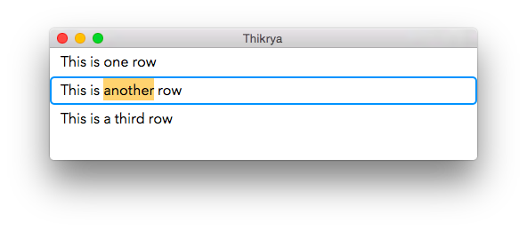



What is it?
-----------

Thikrya is a prototype for a next-generation code editor. The idea is to make
this a GUI like Automator or Scratch that can also be edited using the keyboard,
by effectively having an implementation of auto-completion that generates the GUI
elements.

Beyond that stated purpose, it is also useful as an example of how to implement
your own text editing view on Mac OS X, and currently should handle most things
correctly, except for right-to-left scripts.


License
-------

	Copyright 2015 by Uli Kusterer.
	
	This software is provided 'as-is', without any express or implied
	warranty. In no event will the authors be held liable for any damages
	arising from the use of this software.
	
	Permission is granted to anyone to use this software for any purpose,
	including commercial applications, and to alter it and redistribute it
	freely, subject to the following restrictions:
	
	   1. The origin of this software must not be misrepresented; you must not
	   claim that you wrote the original software. If you use this software
	   in a product, an acknowledgment in the product documentation would be
	   appreciated but is not required.
	
	   2. Altered source versions must be plainly marked as such, and must not be
	   misrepresented as being the original software.
	
	   3. This notice may not be removed or altered from any source
	   distribution.
